# Acuant Xamarin Sample App [DEPRECATED]

Last updated on – 04/06/2018

## Introduction

**THIS SDK HAS BEEN DEPRECATED**

This project illustrates how to integrate Acuant's iOS and Android mobile SDKs while developing an mobile application using Xamarin Studio.

## Sample App download 

 The sample app can be downloaded from the following link 
 
https://support.acuantcorp.com/dlmanager/ClientDownloads/GetFile/WGFtYXJpbi1Nb2JpbGUtU0RLLnppcA

This sample project can also be cloned from the GitHub.

https://github.com/Acuant/AcuantXamarinSampleApp

While cloning this project please pay attention that git-lfs must have been already installed in the system. Without git-lfs the cloning of the repository will not download large files causing build errors.

**Note** : After cloning the repository, run the following command to make sure all files are pulled:

	git lfs pull

## SDK Documentation 

1.	iOS : https://github.com/Acuant/AcuantiOSMobileSDK
2.	Android : https://github.com/Acuant/AcuantAndroidMobileSDK

## Xamarin Sample App project structure

To develop a Xamarin iOS, Android, or Forms app the first step is to build a corresponding platform specific native binding library. We have created a Xamarin Forms app to demonstrate how the bindings work. In this sample app we have already created the binding libraries those can be directly used in your applications.

### iOS Binding

The following image displays the iOS binding library. The ApiDefinition.cs file has all the native API interface definitions. For the detailed documentations of all the APIs please refer https://github.com/Acuant/AcuantiOSMobileSDK . 

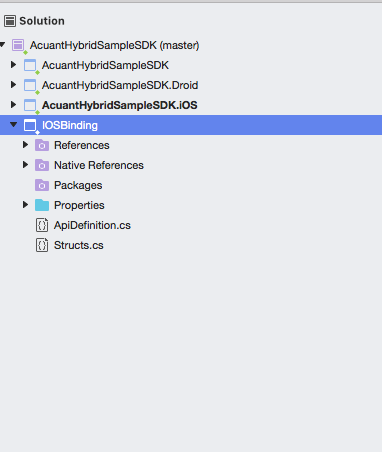

Add reference to the iOS Binding library in the AcuantHybridSampleSDK.IOS (Sample app for iOS) project

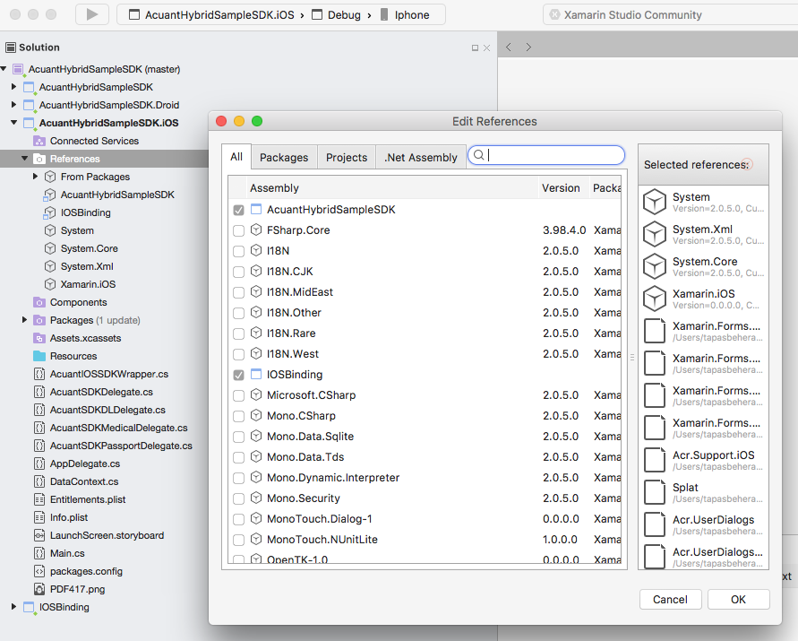

In the root Xamarin Forms project please notice the file IAcuantSDKWrapper.cs file. This file is a common interface file.In this file we have defined all the native interfaces that we need for this sample project. This interface can be implemented in both iOS and Android wrappers to call the corresponding native APIs.

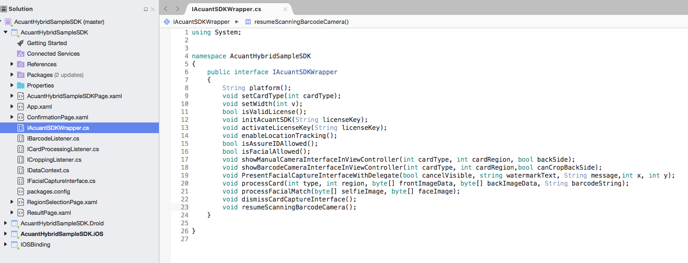  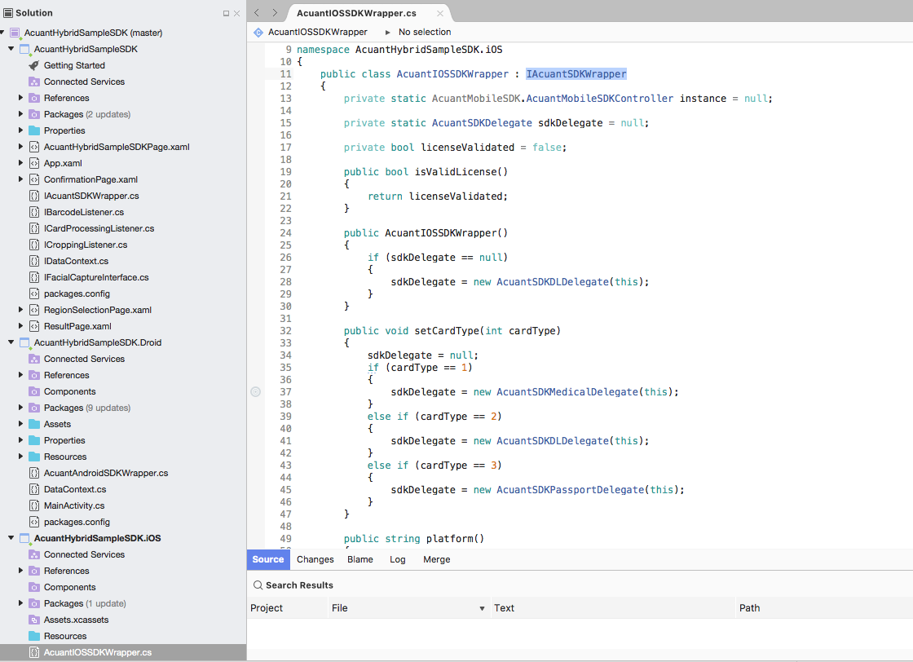

Below is an illustration of implementation(Native API calls) of two iOS native functions, e.g public void activateLicenseKey(String licenseKey) and public void MobileSDKWasValidated(bool wasValidated).

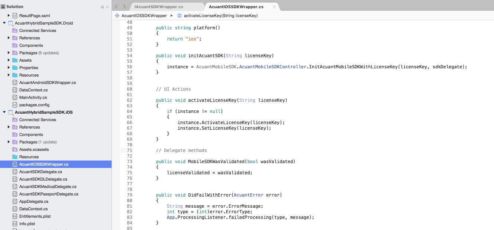

### Android Binding

The following image displays the Android binding library.

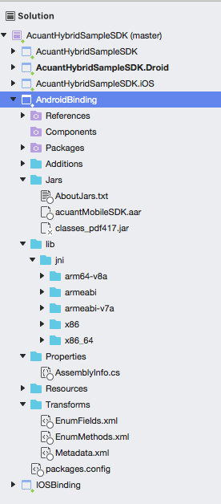

Refer this binding library in the Android Xamarin project as shown below :

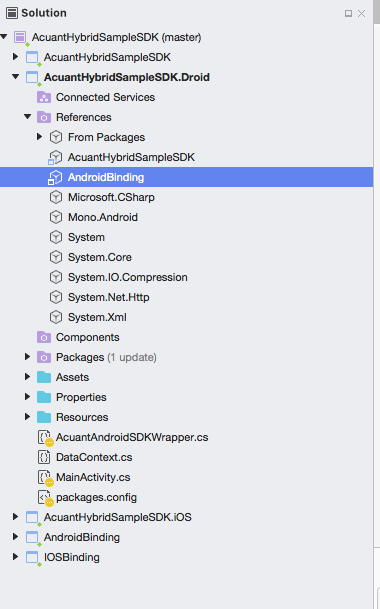

Add all the packages to your project. Please refer the AcuantHybridSampleSDK.Droid project for all depending packages.

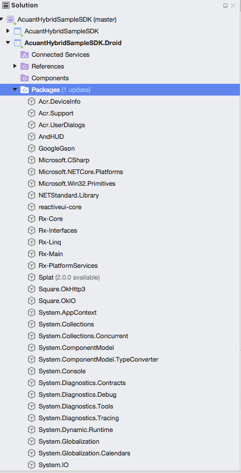

Add the asset folder microblink as shown below :

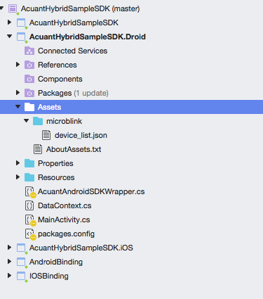

Below is an illustration of implementation(Native API calls) of Android native functions.

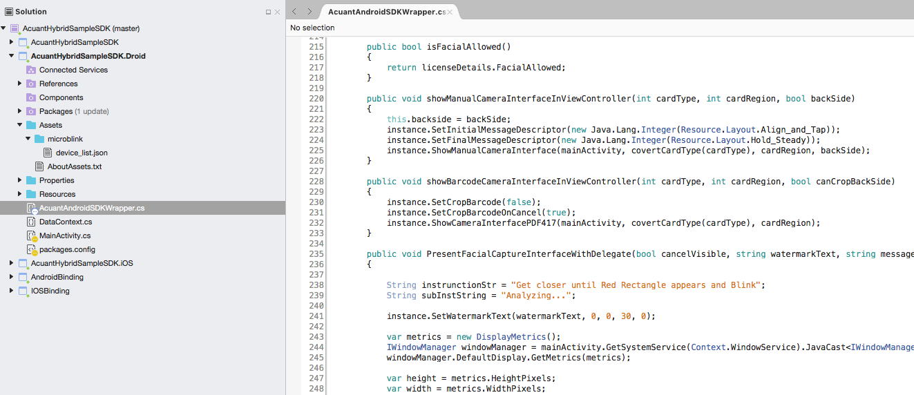

## Setting LicenseKey / Credentials

There are two Sample Apps. 

### Sample App for Acufill Data Extraction and Facial Match

The sample app is AcuantHybridSampleSDK.

Please set the licensekey as below :

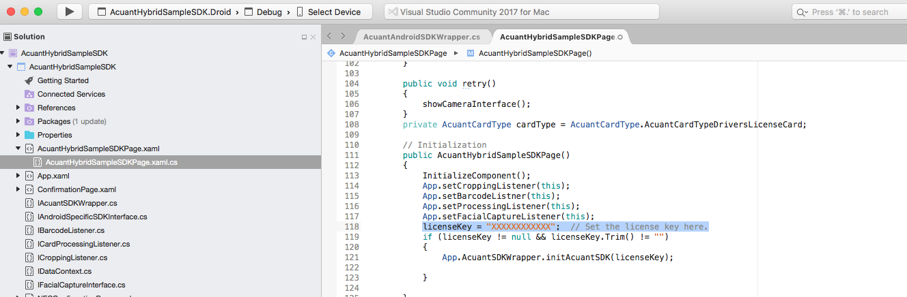

### Sample App for Connect Data Extraction and Facial Match

The sample app is AcuantConnectSampleApp.

Please set the credentials as below :

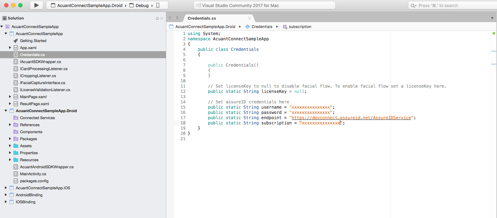

## Conclusion

This is an illustration of how to integrate Acuant iOS/Android Mobile SDK in Xamarin Studio. Developers may modify their implementations as per their need. However we recommend to keep the project structure and interface files similar to reduce the effort of integration in future releases. Also, we will use this project to test any reported defect.

